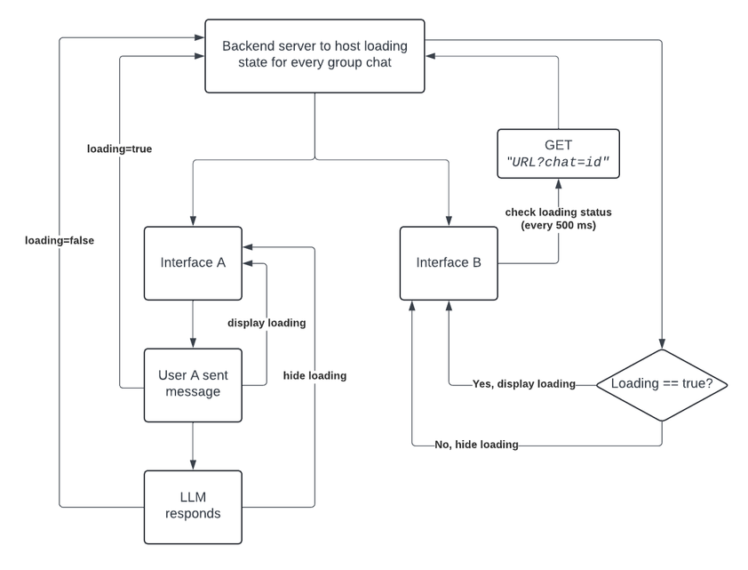

# Project - Stable Group Chat

## Product
Our product is an AI agent — we call him AgentBond, or Bond for short.

It’s aimed towards assisting enterprise users in a specific domain (HubSpot setup & management).

The user types in the chat interface just like ChatGPT, but one of the differences is that our agent takes time to perform some backend operations, which results in a delay for the users — meaning that the users need to know that they can’t send a message while an operation is ongoing.

One of the experiences we offer is group chat.

An example flow of that:

1. User A types in a message
2. LLM takes time to respond (display loading sign)
3. LLM responds
4. User B types in a message
5. Repeat

## Challenge
We don’t actually have a loading sign, so you can imagine the disappointing user experience when A & B send messages right after each other, and the LLM gets confused.

**Example**
Alice: count to 10.  
*HTTP request 1*  
*response 1*  
Bond: 1,2,...,10.  
Alice: count to 20.  
*HTTP request 2*  
Bob: what's the last thing you did?  
*HTTP request 3*  
*response 2*  
Bond: 1,2,...,20.  
*response 3*  
Bond: I counted to 10.  

We want to block Bob from sending a message before a response was received from the LLM.

## Requirements
Here’s what we need on the interface:
1. Alice sends a message & it appears on Bob’s interface
2. Between HTTP req & res, loading sign should appear on both interfaces

Here’s what we need on the backend:
1. A CORS-enabled server to store the loading state & serve it for every chat

## Milestones
This project should be attempted in 2 steps:
1. Interface + server for one chat
2. Scale to handle multiple simultaneous chats

## Proposed Architecture
This is the way I’m thinking of it:



But it would be great if you take some time to see if the architecture could be improved based on the requirements I shared & implement your improved version — in fact, please do take time first to understand the architecture & improve it!

When designing/implementing the backend architecture, keep in mind the following:

- Assume ~10,000 simultaneous individual chats
- Assume ~1000 simultaneous group chats
- Average users per group chat is ~5
- Choose any GCP service you see fit to host the backend
    - You won’t deploy the backend, but here we need a writeup of why you’re choosing this particular service and why it’s the best option given the guidelines I mentioned
- How are we handling latency? Is there a max load on the server that we should know of? Etc.

## How to run this?
Assuming you're in the root directory:
```
cd frontend
npm run dev
```

Note that the relevant code exists in the following structure:
```
- root
  - frontend
    - app
      - components
        - chat-window.js
```

You don't have to interact with any other files, although it might be helpful to look at `handle-firestore.js` (the module responsible for communication with our Firestore DB) because the `chat-window.js` component references it quite a lot.

You have to register with a valid email address, a >6-character password & a picture.

To activate a group chat, simply type the following prompt:
`Add <USER EMAIL> to this chat`

## How does the code work?
Logic is in the `chat-window.js` component.

1. User submits a message
2. We call `handleSubmit`
3. Message is sent to Firestore by calling `sendMessage`
4. `onMessageAdded` trigger gets activated -> updates `chatLog`
5. `useEffect` hook is triggered (gets triggered on updates to `chatLog`)
6. Call `fetchDataWithPrep` to map message objects to just role/content (usable by AI)
7. Call `fetchData` with the prepared messages (notice that `conversationId` is the Firestore chat id, which you'll use in the server to store/access loading signs for multiple chats)
8. Receive response from AI
9. Call `sendMessage` to send the response to Firestore
10. Repeat 3-5 (but this time on step 5 we won't call any functions because `role=='assistant'`)
